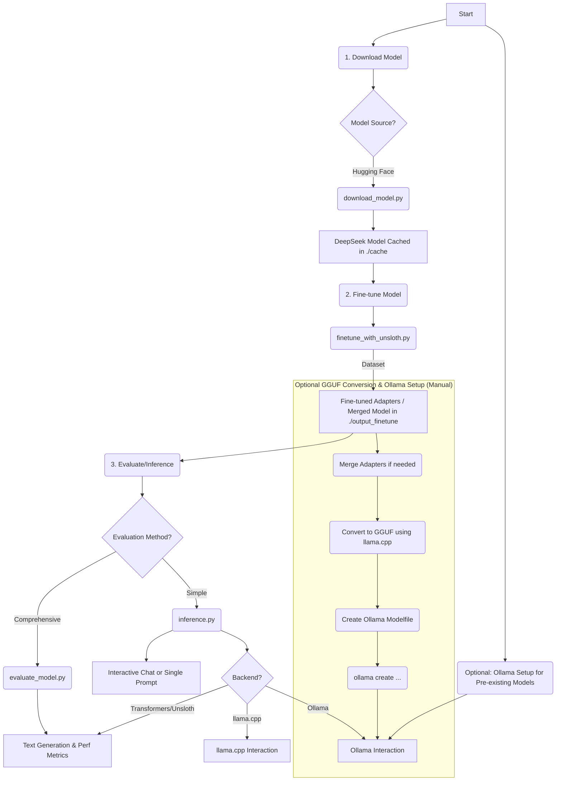

# DeepSeeks-Trial: LLM Fine-tuning & Evaluation Toolkit

This project provides a set of Python scripts to download, fine-tune (using Unsloth for QLoRA), and evaluate Large Language Models (LLMs), with a focus on **DeepSeek-R1-0528** models.
It includes utilities for interacting with models served via Ollama and a simple inference script for quick model interaction.

## About DeepSeek-R1-0528

DeepSeek-R1-0528 is DeepSeek's latest reasoning model update, described as "the world's most powerful open-source model, rivalling OpenAI's GPT-4.5, o3 and Google's Gemini 2.5 Pro" ([source](https://unsloth.ai/blog/deepseek-r1-0528)).

**Key Features:**
- **DeepSeek-R1-0528-Qwen3-8B**: Distilled version (8B parameters) that fits in 20GB RAM
- **Full R1-0528**: 671B parameters, quantized from 720GB to 185GB (75% reduction)
- **Recommended Settings**: Temperature 0.6, Top-p 0.95
- **GGUF Quantizations**: Various quantizations available (Q4_K_XL, UD-Q2_K_XL, UD-IQ1_S)

## Project Workflow



## Directory Structure

```
DeepSeeks-Trial/
├── cache/                    # Default directory for downloaded models
│   └── unsloth/
│       └── DeepSeek-R1-0528-Qwen3-8B-GGUF/
│           └── ... (GGUF model files)
├── output_finetune/          # Default directory for fine-tuning outputs
│   └── final_model/          # LoRA adapters or full fine-tuned model
│   └── final_merged_model/   # (Optional) Merged model
├── download_model.py         # Script to download models from Hugging Face
├── finetune_with_unsloth.py  # Script for fine-tuning models using Unsloth
├── evaluate_model.py         # Script for evaluating models (local or Ollama)
├── inference.py              # Simple inference script with multiple backends
├── README.md                 # This file
└── requirements.txt          # Python dependencies (to be created)
```

## Setup

1.  **Clone the repository:**
    ```bash
    git clone <your-repository-url>
    cd DeepSeeks-Trial
    ```

2.  **Create a Python virtual environment (recommended):**
    ```bash
    python3 -m venv venv
    source venv/bin/activate  # On Windows: venv\Scripts\activate
    ```

3.  **Install dependencies:**
    You will need PyTorch (with CUDA support if you have a GPU), Transformers, Unsloth, Datasets, TRL, Ollama client, and other utilities.

    **Example `requirements.txt` (adapt based on your system and Unsloth version):**
    ```
    torch --index-url https://download.pytorch.org/whl/cu118 # Or your CUDA version e.g. cu121
    transformers
    datasets
    trl
    peft
    accelerate
    bitsandbytes # For 4-bit/8-bit quantization
    # Unsloth: Installation might be specific, e.g., from GitHub or specific wheel
    # pip install "unsloth[colab-new] @ git+https://github.com/unslothai/unsloth.git"
    # Check Unsloth documentation for the latest installation method.
    ollama
    # Add other dependencies like sentencepiece, protobuf as needed
    ```
    Install with: `pip install -r requirements.txt`

4.  **(Optional) Install Ollama:**
    If you plan to use Ollama for serving models, install it from [https://ollama.com/](https://ollama.com/).

5.  **(Optional) Install llama.cpp:**
    If you need to convert models to GGUF format or use llama.cpp backend, follow instructions on their [GitHub repository](https://github.com/ggerganov/llama.cpp).

## Quick Start

### Download a DeepSeek Model
```bash
# Download DeepSeek-R1-0528-Qwen3-8B with Q4_K_XL quantization (default)
python download_model.py
# Model will be saved to ./cache/unsloth/DeepSeek-R1-0528-Qwen3-8B-GGUF/
```

### Simple Inference
```bash
# Interactive chat (after downloading)
python inference.py --backend transformers --model ./cache/unsloth/DeepSeek-R1-0528-Qwen3-8B-GGUF --interactive

# Single prompt with Ollama
python inference.py --backend ollama --model "hf.co/unsloth/DeepSeek-R1-0528-Qwen3-8B-GGUF:Q4_K_XL" --prompt "Explain quantum computing in simple terms"

# Use preset for convenience
python inference.py --preset qwen3-8b-gguf --backend ollama --interactive
```

## Usage

### 1. Downloading Models (`download_model.py`)

This script downloads DeepSeek models from Hugging Face Hub.

```bash
python download_model.py [--repo_id <repository_id>] [--local_dir <path>] [--allow_patterns "*.gguf"] [--token <your_hf_token>]
```

*   `--repo_id`: Model repository ID. **Default**: `unsloth/DeepSeek-R1-0528-Qwen3-8B-GGUF`
*   `--local_dir`: Local directory to save files. **Default**: `./cache/OWNER/MODEL_NAME`
*   `--allow_patterns`: Glob patterns to filter files. **Default**: `["*Q4_K_XL*"]`
*   `--token`: (Optional) Hugging Face API token for private repositories.

**Examples:**
```bash
# Download default DeepSeek-R1-0528-Qwen3-8B (Q4_K_XL)
python download_model.py

# Download different quantization
python download_model.py --allow_patterns "*UD-Q2_K_XL*"

# Download full R1-0528 model (185GB 1.78-bit quantization)
python download_model.py --repo_id unsloth/DeepSeek-R1-0528-GGUF --allow_patterns "*UD-IQ1_S*"
```

### 2. Simple Inference (`inference.py`) - **Recommended for Quick Testing**

This script provides an easy-to-use interface for running inference with DeepSeek models.

```bash
python inference.py [--backend <backend>] [--model <path>] [--preset <preset>] [--prompt <text>] [--interactive]
```

**Key Arguments:**
*   `--backend`: Choose from `transformers`, `unsloth`, `ollama`, `llama.cpp`
*   `--model`: Path to model or Ollama model name
*   `--preset`: Use predefined model configurations (see `--list-presets`)
*   `--interactive`: Start interactive chat mode
*   `--prompt`: Single prompt for inference

**Available Presets:**
```bash
python inference.py --list-presets
```

**Examples:**
```bash
# Interactive chat with local Transformers model
python inference.py --backend transformers --model ./cache/unsloth/DeepSeek-R1-0528-Qwen3-8B-GGUF --interactive

# Single prompt with Ollama using preset
python inference.py --preset qwen3-8b-gguf --backend ollama --prompt "Write a Python function to calculate fibonacci numbers"

# llama.cpp backend with local GGUF file
python inference.py --backend llama.cpp --model ./path/to/model.gguf --prompt "Explain machine learning"

# Interactive chat with Unsloth backend
python inference.py --backend unsloth --model ./cache/unsloth/DeepSeek-R1-Distill-Qwen-1.5B-bnb-4bit --interactive
```

### 3. Fine-tuning Models (`finetune_with_unsloth.py`)

This script fine-tunes DeepSeek models using Unsloth with QLoRA.

**Important:** You **MUST** adapt the `formatting_prompts_func` within the script to match your dataset's structure and DeepSeek's chat format.

```bash
python finetune_with_unsloth.py \
    --model_name <base_model_id_or_path> \
    --dataset_path_train <path_to_train_data> \
    [--dataset_path_eval <path_to_eval_data>] \
    [--output_dir <output_path>] \
    [--epochs <num_epochs>] \
    [--merge_lora_after_training] \
    # ... other arguments (see script --help for details)
```

*   `--model_name`: **Default**: `unsloth/DeepSeek-R1-Distill-Qwen-1.5B-bnb-4bit`
*   `--dataset_path_train`: Path to your training data file (JSON/JSONL format)
*   `--merge_lora_after_training`: Merge LoRA adapters with base model after training

**Example:**
```bash
python finetune_with_unsloth.py \
    --model_name unsloth/DeepSeek-R1-Distill-Qwen-7B-bnb-4bit \
    --dataset_path_train ./my_dataset/train_data.jsonl \
    --output_dir ./my_finetuned_deepseek \
    --epochs 3 \
    --merge_lora_after_training
```

**Dataset Format:** The script expects data in DeepSeek chat format with `\` and `\` tokens. Supported formats:
```json
{"text": "Question hereAnswer here"}
{"instruction": "Question", "output": "Answer"}
{"user": "Question", "assistant": "Answer"}
```

### 4. Comprehensive Evaluation (`evaluate_model.py`)

This script provides detailed evaluation capabilities for fine-tuned models.

**A. Evaluating a local model:**

```bash
python evaluate_model.py \
    --model_path <path_to_your_model_or_adapters> \
    [--base_model_name <original_base_model_id_if_loading_adapters>] \
    [--use_unsloth_loader] \
    [--prompt "Your test prompt"] \
    [--measure_perf]
```

**Example:**
```bash
python evaluate_model.py \
    --model_path ./my_finetuned_deepseek/final_model \
    --base_model_name unsloth/DeepSeek-R1-Distill-Qwen-7B-bnb-4bit \
    --use_unsloth_loader \
    --prompt "Question hereAnswer here" \
    --measure_perf
```

**B. Interacting with an Ollama model:**

```bash
python evaluate_model.py \
    --ollama_model "hf.co/unsloth/DeepSeek-R1-0528-Qwen3-8B-GGUF:Q4_K_XL" \
    --prompt "Why is the sky blue?"
```

## Using DeepSeek Models with Ollama

### Option 1: Direct Pull from Hugging Face (Easiest)
```bash
ollama run hf.co/unsloth/DeepSeek-R1-0528-Qwen3-8B-GGUF:Q4_K_XL
```

### Option 2: Convert Fine-tuned Model to GGUF (Advanced)

If you have fine-tuned a model and want to use it with Ollama:

1.  **Merge LoRA Adapters:** Use `--merge_lora_after_training` in `finetune_with_unsloth.py`

2.  **Convert to GGUF:** Use `llama.cpp` to convert the merged model:
    ```bash
    # In your llama.cpp directory
    python convert.py /path/to/your/merged_hf_model --outtype f16 --outfile temp_model.gguf
    ./quantize temp_model.gguf /path/to/output/final_model_q4km.gguf Q4_K_M
    ```

3.  **Create Ollama Modelfile:**
    ```Modelfile
    FROM ./final_model_q4km.gguf
    TEMPLATE """Question hereAnswer here"""
    PARAMETER temperature 0.6
    PARAMETER top_p 0.95
    ```

4.  **Register with Ollama:**
    ```bash
    ollama create my-deepseek-model -f /path/to/your/Modelfile
    ```

## Notes

*   **DeepSeek Chat Format**: Use \` and \` tokens for proper formatting
*   **Recommended Settings**: Temperature 0.6, Top-p 0.95 (as per [Unsloth's recommendations](https://unsloth.ai/blog/deepseek-r1-0528))
*   **Memory Requirements**: 
    - Qwen3-8B: ~20GB RAM minimum
    - Full R1-0528: 64GB+ RAM, 180GB+ for optimal performance
*   **Fine-tuning**: Always adapt `formatting_prompts_func` in `finetune_with_unsloth.py` to your dataset
*   **GPU Support**: Ensure CUDA setup for optimal performance with large models

## Contributing

Feel free to contribute by improving the scripts, adding new features, or reporting issues.

## References

- [Unsloth DeepSeek-R1-0528 Blog Post](https://unsloth.ai/blog/deepseek-r1-0528)
- [DeepSeek Official Repository](https://huggingface.co/deepseek-ai)
- [Unsloth Documentation](https://docs.unsloth.ai/)